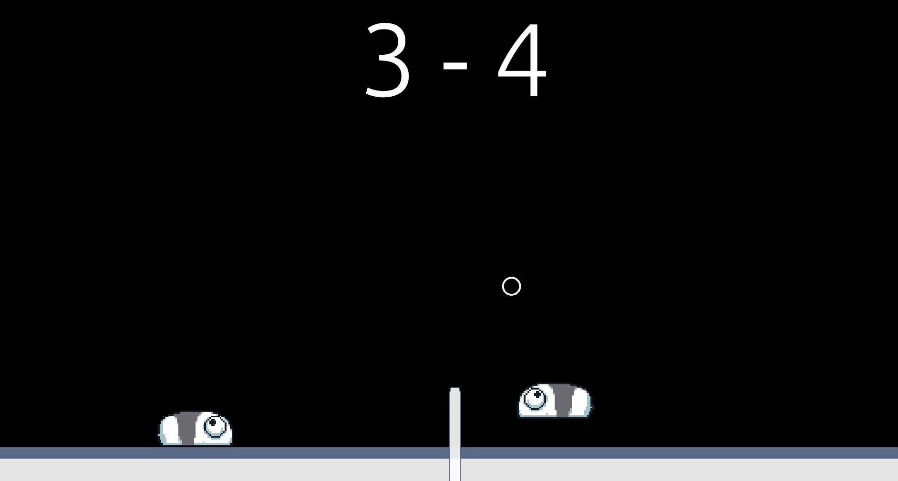

<div align="center">
<h2>Bones Volleyball</h2>

</div>

Bones Volleyball is an mvp example game implemented in Rust using the [Bones game engine](https://github.com/fishfolk/bones). This project serves as a demonstration of how to create a simple 1v1 networked game with rollback netplay functionality, with comments throughout the code which can help as a starting guide for learning how to use bones.

## About

The game itself features 2 players, each one assigned an `idx` where 0 is on the left and 1 is on the right. If the ball touches the ground on your side, the opponents gains a point. The first player to get to 15 wins.

Both controller and keyboard are natively supported, with directional inputs + jump.

This game utilizes a default hosted [bones_matchmaker](https://github.com/fishfolk/bones/tree/main/other_crates/bones_matchmaker) which is usable without any additional configuration (at the time of this project's creation). In other words, the matchmaker is used to initiate the match between 2 game clients and the inner library in bones (iroh) connects the two players either directly together for fast p2p networking, or through a relay if required (for nat traversal or otherwise).

If you wish to use your own matchmaker, you can run one on a server and update the `matchmaking_server` key in the `assets/game.yaml` file in this project.


## Setup Instructions

1. Clone the repository:
   ```
   git clone https://github.com/RockasMockas/bones_volleyball.git
   ```

2. Navigate to the project directory and run the game in two different terminal windows:
   ```
   cargo run
   ```

3. In both game windows, select "Online Play" and choose an input delay.

4. Enjoy a basic 1v1 volleyball game!

**Tip:** Press F1 to open the networking debug menu to see things like ping, networking throughput, frame data, etc.

## License

This project is licensed under the MIT License.